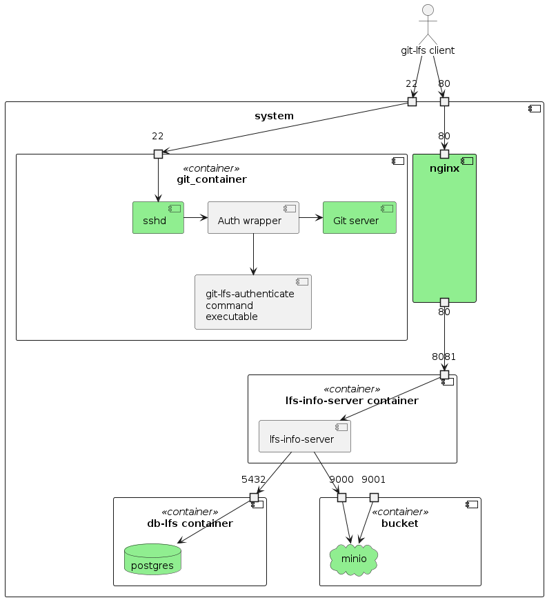
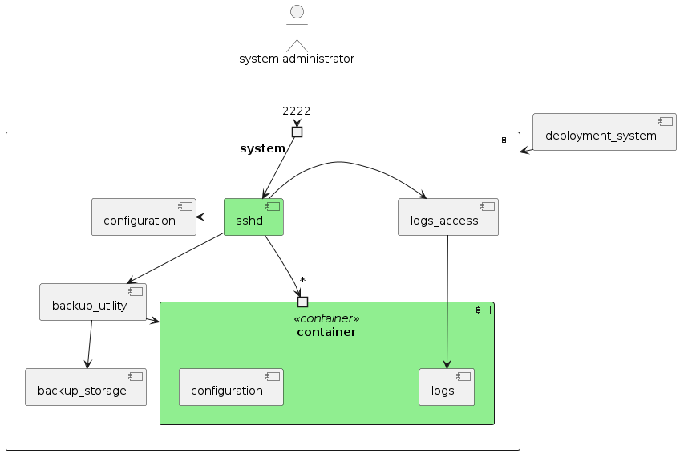

# Component Choice

## Largely used components

A few components are so largely used that they are almost a standard in the industry. They are used in almost every project and are very well documented. 

To handle the SSH connexions (requirement R1.2), the *sshd* deamon is used. It is the standard SSH server for Linux using the OpenSSH implementation of SSH. It is very well documented and is used in almost every Linux distribution. It supports the SSH protocol version 1 and 2. 

To conteneurise the application (requirement R4.1), Docker is used. It is also now a standard in the industry. Docker-compose can be used to describe the containers and their interactions. 

To expose ports in a secure way (requirement R4.2), we can leverage containers to only expose the ports we want to expose, then use a reverse proxy to expose the containers. This way, we can have a single entry point to the application and we can easily add rate limitations and protections. A standard reverse proxy is Nginx, that can be configured with a single file, to satisfy the requirement R4.

To handle stateless proofs of access (requirement R4.3), we can use JWT tokens. Their security has been proven and they allow for json complex payload.

Storages (requirement R2.2) can be handled by a MinIO instance, a local file storage, databases. As discussed previously, the storage is often one of the component the organizations want to keep control of, so several implementations will be available.

To handle git commands, nothing best than the git command line tool. It is already a server and is the reference, production ready implementation of git. 

At this point, if we go back to the components view, in green are colored the components that are now well defined. 

## Git wrapper

To bring the authentication and authorization layer to git, two solutions are possible. 

The first one is to use unix permissions and allow users to run git command (and only git commands) directly through SSH. If they push to an authorized location, the push will be accepted. If they push to an unauthorized location, the push will be rejected. This solution seems simple, but managing hundreds or thousands of users on a single server using only unix permissions is hard to do right. The developpment of a custom solution would be required. Auditing history of permissions changes would not be possible without another layer.  

The single solution, addopted by almost every large actor (Github, Gitlab, Bitbucket, etc.) is to create a single git user. Then all users add their public keys, and when they login, their key is verified, and they are identified by them. A very clever implementation of these mechanisms is provided by Gitolite. It is a git server that allows to manage users and their permissions using a git repository. It is very well documented and is used for instance the KDE project, the Fedora project, kernel.org, gentoo linux, etc.

Gitolite would satisfy a lot of requirements:

- **R1.1**: Gitolite expose a gitolite-shell command line that proxy git commands to the git server, so all regular git commands are available.
- **R1.2**: Gitolite is put just behind the SSH server
- **R2.1** and **2.4**: Gitolite defines a repository "gitolite-admin" that contain all the public keys of users, and a list of repositories, with each user having read or write access to each of them. Changing permissions is a simple as modifying this file and pushing modification. 
- **R2.5**: gitolite is under the GPL v2 license, allowing for commercial use, modification and distribution. However it contaminates the code that uses it with the GPL license. Using it will therefore require good separations between this component and other components that might need to be modified by enterprises in a proprietary way.
- **R2.6**: gitolite is still very active (last commit was 2 months ago, there are 38 contributors, 8.2k stars on github, and 1k forks)
- **R3.1**: the system is heavily used and tested, and might be considered very stable.

Gitolite also allow for custom commands to be injected in the system. It would then be possible to implement the *git-lfs-authenticate* command inside gitolite, in rust, getting gitolite to verify the user, signing the JWT, and returning it to the client for later use. Such a simple command can be done in a few hours. 

Remains one of the big part: the git lfs server, that is not handled by gitolite.

## Git LFS server implementations
The git lfs team list a few implementations of their protocol on [https://github.com/git-lfs/git-lfs/wiki/Implementations](https://github.com/git-lfs/git-lfs/wiki/Implementations)

However, most of them do not match our requirements:

- *jasonwhite/rudolfs* lacks authentication, not even supporting jwt
- *git-lfs/lfs-test-server*, *cloudmazing/lfs-server-go* are not production ready
- *artemkin/git-lfs-server*, *cbartz/git-lfs-swift*, *meltingice/git-lfs-s3*, *mgax/lfs*, *kzwang/node-git-lfs* are deprecated or unmaintained
- *bozaro/git-as-svn* and *saracen/lfscache* are out of scope, they primarily focus on caching, or making git work like svn. 
- *charmbracelet/git-lfs-transfer* and *autovia/git-lfs-transfer* are exploratory works of lfs over ssh, but are not compatible with regular git lfs clients
- *metalogical/BigFiles*, *gitlit*, *AKSW/git\_lfs\_server\_sshauth*, *khoa-io/git-lfs*, *alanedwardes/Estranged.Lfs* are only partial implementations of the API
- *OneDev*, *GitBucket*, *Gitea*, *GitLab*, *Gitblit*, *SCM-Manager* are full git platforms, so too high level to be used as foundation for custom enterprise solutions

It remains two solutions to investigate

- *bozaro/git-lfs-java* is a Java implementation that supports locks, objects batch apis. It defines no implementation though, but it might be possible to implement them in Java. However, last human commit was one year ago, and the project is not very used. The project is licenced under the LGPL v3 license, allowing for commercial use, modification and distribution. However it contaminates the code that uses it with the LGPL license.
- *datopian/giftless* support basic transfer, S3 backend storage, and jwt authentication. It is written in python. It is a little more used (25 forks and 85 stars)

Both implementations will need to be extended, and the git-lfs-java will be hard to extends legally, and safely, as rust will not be an option. The giftless implementation is more promising, but present few garanties of performance and stability. This server will be a part of the system that would benefit the most from a custom implementation that is stable, performant, and that can be modified by enterprises in a proprietary way.
