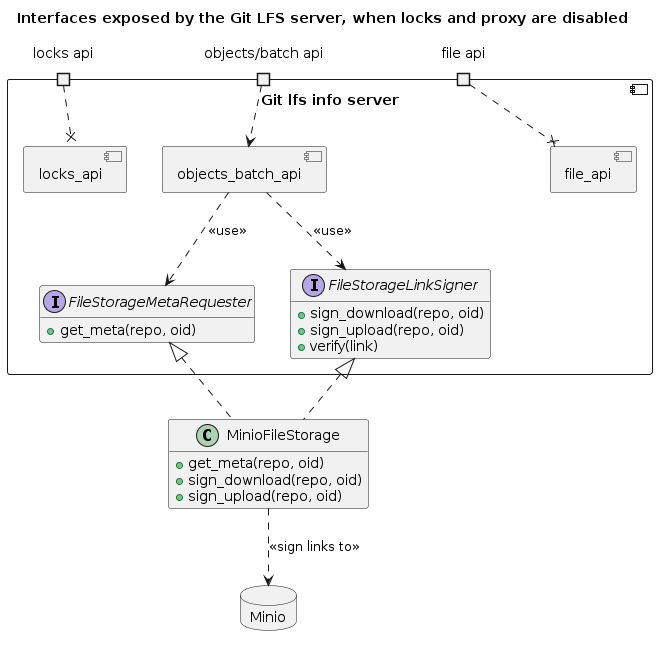

\newpage
# Git LFS Server

As discussed, we need to implement a git lfs server that match our requirements. One of the most complex one is reusability and modularity with several storage backends.

## Storage backends and services injections

The figure next figure shows the architecture of the git lfs server services. Three apis are exposed:

- The objects batch api, to request links that will be used to upload and download objects.
- The file api, to actually upload and download objects
- The locks api.

In this mode, all apis are enabled, and two classes implement the storage backend interfaces, using postgresql for locks and minio for files.

On the other hand, one might not need the locks api, or might implement a link signer that redirect directly to the storage server. In that case, not all interfaces will be injected, and considering only the ones that are, the system will look like the next figure.

## Locks api requirements

The requirement **R1.4** can be further derived from the official specification into:

- **R1.4.1**: the server shall expose a `POST /locks` route, accepting a payload with a repo name, a path, and a ref, that create a lock for the path, the ref, and the repo, and mark user as the owner of the lock.
- **R1.4.2**: the server shall respond to a lock creation either by returning the lock, by a "bad response, lock exists" response, including the existing lock
- **R1.4.3**: the server shall expose a `GET /locks` route, accepting a payload with optional paths, id, refspec; it shall match all corresponding locks and return them.
- **R1.4.4**: the server shall expose a `POST /locks/verify` route, accepting a payload with an optional ref name, and locks separated between *ours* (the locks of user) and *theirs** (the locks of teammates)
- **R1.4.5**: the server shall accept cursor, limit in the `GET /locks` and `POST /locks/verify` payload, so it selects at most *limit* locks, starting at *cursor*. It shall return the next cursor if there are more than *limit* locks
- **R1.4.6**: the server shall expose a `POST /locks/:id/unlock`, that delete the lock by id and return it.
- **R1.4.7**: the server shall verify that user deleting a lock is owner of the lock. If he is not, the deletion shall only occur if an attribute `force:true` is passed in the payload.
- **R1.4.8**: the server shall verify that user has the right to write the repository, checking for the json web token
- **R1.4.9**: for all routes, in the event of an error, the server shall return an error response as a JSON containing a message property.
- **R1.4.10**: any route shall respect the schemas defined in the (https://github.com/git-lfs/git-lfs/blob/main/docs/api/locking.md)[https://github.com/git-lfs/git-lfs/blob/main/docs/api/locking.md]

## Batch api requirements

The requirement **R1.3** can be further derived from the official specification into:

- **R1.3.1**: the server shall accept a get request on route /objects/batch?repo=... with payload matching the payload from (https://github.com/git-lfs/git-lfs/blob/main/docs/api/batch.md#requests)[https://github.com/git-lfs/git-lfs/blob/main/docs/api/batch.md#requests]
- **R1.3.2**: the server shall return for route objects\_batch the operation, the hash\_algo, and an array of objects containing presigned links to perform a download/upload operation, according to the (https://github.com/git-lfs/git-lfs/blob/main/docs/api/batch.md#successful-responses)[https://github.com/git-lfs/git-lfs/blob/main/docs/api/batch.md#successful-responses]
- **R1.3.3**: In case of error generating the link, the error returned should be embedded into the response (the request shall not fail) according to the (https://github.com/git-lfs/git-lfs/blob/main/docs/api/batch.md#successful-responses)[https://github.com/git-lfs/git-lfs/blob/main/docs/api/batch.md#successful-responses]. The error shall be one of
    - *404*: The object does not exist on the server.
    - *409*: The specified hash algorithm disagrees with the server's acceptable options.
    - *410*: The object was removed by the owner.
    - *422*: Validation error.
- **R1.3.4**: In case of failure leading to global failure of the request, the server shall return the appropriate HTTP status code and a json object containing a message property. Only the following errors shall happen:
    - *401*: The authentication credentials are needed, but were not sent. Git LFS will attempt to get the authentication for the request and retry immediately.
    - *403*: The user has read, but not write access. Only applicable when the operation in the request is "upload."
    - *404*: The Repository does not exist for the user.
    - *422*: Validation error with one or more of the objects in the request. This means that none of the requested objects to upload are valid.
    - *406*: The Accept header needs to be application/vnd.git-lfs+json.
    - *413*: The batch API request contained too many objects or the request was otherwise too large.
    - *429*: The user has hit a rate limit with the server. Though the API does not specify any rate limits, implementors are encouraged to set some for availability reasons.
    - *501*: The server has not implemented the current method. Reserved for future use.
    - *507*: The server has insufficient storage capacity to complete the request.
    - *509*: The bandwidth limit for the user or repository has been exceeded. The API does not specify any bandwidth limit, but implementors may track usage.
    - *500*: Any other server error
